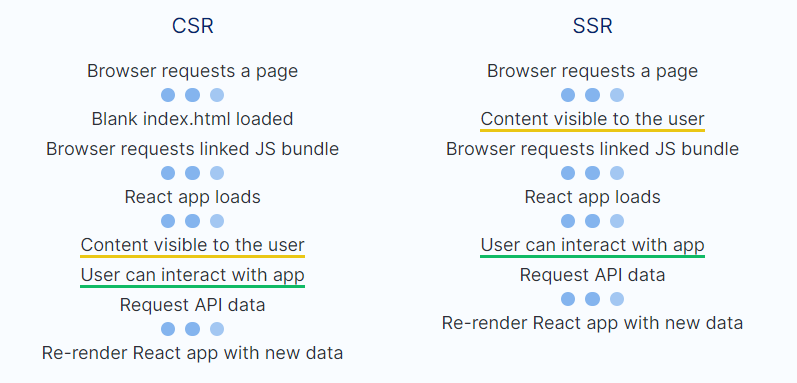

# Next JS Notes

```
yarn create next-app
```

or for existing project

```
yarn add next react react-dom
```

package.json:

```
"scripts": {
  "dev": "next dev",
  "build": "next build",
  "start": "next start"
}
```

## Next JS Key Features

Pre-rendering: Next.js generates HTML for each page in advance, as opposed to client-side JavaScript rendering.

Two forms of Pre-rendering:

- **Static Generation (Recommended):** The HTML is generated at build time and will be reused on each request.
- **Server-side Rendering:** The HTML is generated on each request.

When Should I Use Next JS?

- Most or all the content is static (i.e. no reliance on an external API to display data based on user actions) => static site generator such as GatsbyJS
- A web app with a lot of dynamic content and most pages accessible only by authenticated users => use client-side rendering since SEO is not necessary
- **A web app with a lot of dynamic content and most of the pages accessible by the general public** => Best scenario to use server-side rendering - USE NEXT.JS

Benefits:

- Better percieved performance
- SEO (Search Engine Optimization)

Drawbacks:

- Lack of compatibility with other React libraries
- Although better percieved performance, may not actually be more performant;
  When rendering HTML on the server, the server needs to itself load the React app, and it also needs to run a synchronous method called renderToString() in order to generate the required HTML markup that will be sent to the client. Because of this,

### Client vs Server Side Rendering



Server Side Rendering Steps:

1. Browser requests a page (client)
2. Server loads React from memory (server)
3. Server renders HTML based on the virtual DOM created by the React app (server)
4. Server sends generated HTML to the browser (server)
5. Content visible to the user
6. Request JS Bundle (client)
7. React app loads in the browser (client)
8. User can interact with app
9. Request API data from the backend (client)
10. Re-render React app with new data (client)

## Pages and Routing

Exports routes as path under the `pages` folder:

```
| pages
|   | index.js
|   | _app.js
|   | about.js
|   | goto
|       | index.js
|       | [id].js
```

built-in names:
`pages`: root path
`index`: root of current folder
`_app`: for custom app component to initialize pages
`_document`: for custom document component to define <html> and <body> tags

/\* [id] dynamic route to given `id`.

### Link between pages

```
import Link from "next/link"

const id = '123fakeid'

export default function IndexPage() {
  return (
    <div>
      <Link href="/about">
        <a>About page</a>
      </Link>
  )
}

```

Use href to define route and parameters

index.js

```
<Link
    href={{
    pathname: "/search",
    query: { name: "test" },
    }}
>
    <a>click here</a>
</Link>
```

use `useRouter` hook or `getInitialProps` for access to router object/params

search.js

```
import { useRouter } from "next/router"

export default function SearchResults() {
  const router = useRouter()
  const {
    query: { name },
  } = router
  return <div>Results for : {name}</div>
}
```

Must use `getInitialProps` if using server-side-rendering

```
export default function SearchResults({ name }) {
  return <div>Results for : {name}</div>
}

SearchResults.getInitialProps = ({ query: { name } }) => {
  return { name }
}
```

### Dynamic Routing

index.js

```
export default function IndexPage() {
  return (
    <Link href="/[slug]" as="/my-slug">
        <a>First Route</a>
    </Link>
    <Link href="/my-folder/[id]" as="/my-folder/my-id">
        <a>Second Route</a>
    </Link>
  )
}
```

Can get route params with `useRouter` on client or `getInitialProps` on server

[slug].js

```
import { useRouter } from "next/router"

export default function DynamicPage() {
  const router = useRouter()
  const {
    query: { id },
  } = router
  return <div>The dynamic route is {id}</div>
}
```
