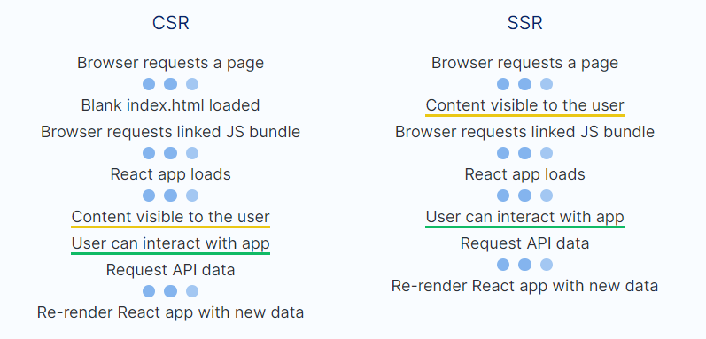

# Next JS Notes

```
yarn create next-app
```

or for existing project

```
yarn add next react react-dom
```

package.json:

```
"scripts": {
  "dev": "next dev",
  "build": "next build",
  "start": "next start"
}
```

## Next JS Key Features

Pre-rendering: Next.js generates HTML for each page in advance, as opposed to client-side JavaScript rendering.

When Should I Use Next JS?

- Most or all the content is static (i.e. no reliance on an external API to display data based on user actions) => static site generator such as GatsbyJS
- A web app with a lot of dynamic content and most pages accessible only by authenticated users => use client-side rendering since SEO is not necessary
- **A web app with a lot of dynamic content and most of the pages accessible by the general public** => Best scenario to use server-side rendering - USE NEXT.JS

Benefits:

- Better percieved performance
- SEO (Search Engine Optimization)



Drawbacks:

- Lack of compatibility with other React libraries
- Although better percieved performance, may not actually be more performant;
  When rendering HTML on the server, the server needs to itself load the React app, and it also needs to run a synchronous method called renderToString() in order to generate the required HTML markup that will be sent to the client. Because of this,

Server Side Rendering Steps:

1. Browser requests a page (client)
2. Server loads React from memory (server)
3. Server renders HTML based on the virtual DOM created by the React app (server)
4. Server sends generated HTML to the browser (server)
5. Content visible to the user
6. Request JS Bundle (client)
7. React app loads in the browser (client)
8. User can interact with app
9. Request API data from the backend (client)
10. Re-render React app with new data (client)
